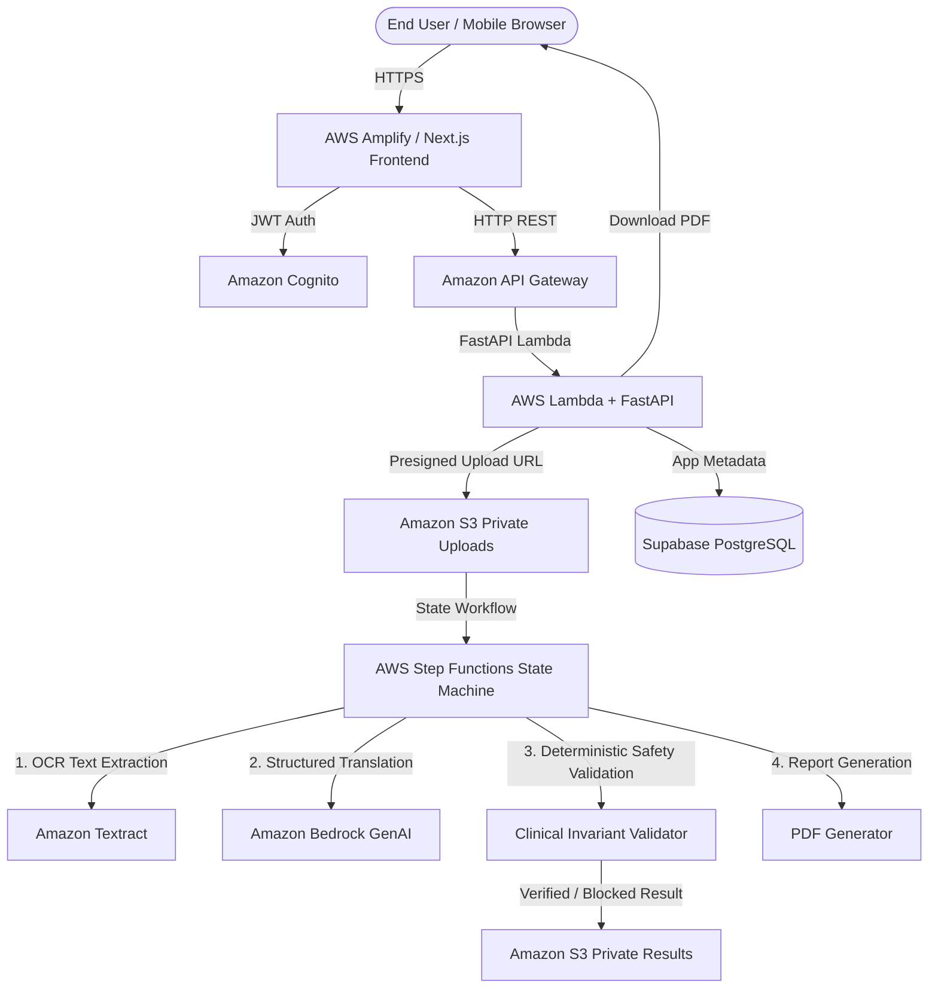

# MediTranslate — AWS-Native Medical Document Understanding Platform

**Hackathon Entry:** AWS Zero to Shipped Hackathon 2026  
**Category:** Social Good — Health | **Lane:** Community  
**Creator & Architect:** Suraj Jaiswal  

---

## 1. What Problem This Solves

Patients, caregivers, migrant workers, and multilingual families frequently receive critical healthcare documents—such as prescriptions, lab reports, discharge summaries, and vaccination records—in languages they cannot understand.

Generic translation tools (like Google Lens or Google Translate) fail in healthcare scenarios because:
1. They perform literal word-for-word translation without plain-language medical context.
2. They risk altering critical numbers, drug names, and units (e.g. mistranslating `500 mg` as `50 mg` or `mg` as `mcg`).
3. They lack patient data privacy and auto-deletion policies.

**MediTranslate** solves this by providing a safety-first accessibility platform that extracts medical text via **Amazon Textract**, translates and simplifies it into plain language using **Amazon Bedrock**, and deterministically verifies clinical numbers, dosage units, and medication names before displaying results.

### MediTranslate vs. Generic OCR (e.g. Google Lens)

| Feature / Metric | Generic Tools (e.g. Google Lens) | MediTranslate |
| :--- | :---: | :---: |
| **Translation Style** | Literal word-for-word | **Plain-language patient explanations** |
| **Medical Terms & Acronyms** | Translates literally (`BID`, `PC`) | **Explains clearly** (*"Take twice daily after meals"*) |
| **Dosage Safety Guard** | ❌ None (risks `500mg` → `50mg`) | ✅ **Deterministic Clinical Value Validator** |
| **Instruction Safety Blocking** | ❌ None | ✅ **Blocks unverified/altered instructions** |
| **Source Evidence Mapping** | Raw text overlay | **Traces every item to original OCR line & confidence** |
| **Structured Output** | Raw text overlay | **Medication cards, lab test summaries, follow-up timeline** |
| **Exportable Summary** | Screenshot only | **Downloadable, printable PDF patient report** |
| **Data Privacy Policy** | Stored in general cloud search logs | **Private S3 storage with 7-day auto-purge policy** |

---

## 2. System Architecture



### Safety Pipeline Workflow
`Upload → Document Classification → Textract OCR → OCR Confidence Check → Clinical Entity Extraction → Bedrock Translation/Plain-Language Explanation → Deterministic Clinical Invariant Validator → PASS/WARNING/BLOCK → Evidence-linked structured result → PDF.`

### Tech Stack
* **Frontend:** Next.js (App Router, Server Components), Tailwind CSS, Lucide Icons
* **Backend API:** Python FastAPI, Pydantic v2, ReportLab PDF
* **Database:** Supabase PostgreSQL (Local SQLite fallback for dev)
* **AWS Cloud Infrastructure:** Amazon Textract, Amazon Bedrock, Amazon Cognito, Amazon S3, AWS Step Functions, AWS Lambda, API Gateway, AWS Amplify, AWS CDK (TypeScript)

---

## 3. How to Run

### Step 1: Environment Setup ($0 Cost — No Cloud Credentials Required)
```bash
cp .env.example .env
```
*(Default fallbacks enable complete offline testing at $0 cost.)*

---

### Option A: Local Run (Fastest for Development)

#### 1. Start Backend API (FastAPI)
```bash
cd apps/api
# Create venv if needed: python3 -m venv venv && source venv/bin/activate && pip install -r requirements.txt
./venv/bin/uvicorn app.main:app --host 127.0.0.1 --port 8000
```
* **Backend API:** [http://127.0.0.1:8000](http://127.0.0.1:8000)
* **Swagger API Docs:** [http://127.0.0.1:8000/docs](http://127.0.0.1:8000/docs)
* **Health Check:** [http://127.0.0.1:8000/health](http://127.0.0.1:8000/health)

#### 2. Start Frontend Web App (Next.js)
```bash
npm --prefix apps/web run dev
```
* **Web App UI:** [http://localhost:3000](http://localhost:3000)

---

### Option B: Docker Compose Run

```bash
docker compose up --build
```
* **Web App:** [http://localhost:3000](http://localhost:3000)
* **FastAPI Backend:** [http://localhost:8000](http://localhost:8000)

---

### 🧪 Running Automated Tests

```bash
# Run backend pytest suite + deterministic safety validator tests
cd apps/api && PYTHONPATH=. ./venv/bin/python -m pytest

# Run frontend TypeScript typecheck
npm --prefix apps/web run typecheck
```
